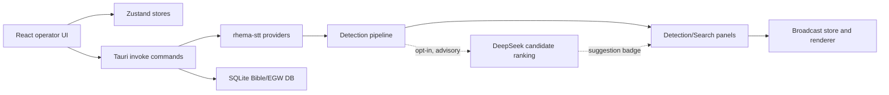

# Codebase Map - SabbathCue

Created: 2026-07-12 - Last verified: 2026-07-31 - Confidence: Medium

## 0 - Snapshot

| Field                              | Value                                                                                                                                                          |
| ---------------------------------- | -------------------------------------------------------------------------------------------------------------------------------------------------------------- |
| Purpose (one line)                 | Desktop app for real-time sermon transcription, Bible/EGW/hymn detection, and broadcast overlays. Receipt: README.md:7, README.md:9                            |
| Primary language(s) / framework(s) | TypeScript/React frontend, Rust/Tauri backend. Receipt: package.json:83, package.json:127, src-tauri/Cargo.toml:55                                             |
| Repo shape                         | App monorepo with web UI, Tauri shell, Rust crates, data/docs/landing collateral. Receipt: package.json:6, src-tauri/Cargo.toml:30, README.md:253              |
| Entry points (count)               | Vite app, Tauri app, Rust crates, landing/docs assets. Receipt: package.json:7, package.json:13, src-tauri/src/lib.rs:126                                      |
| Persistence                        | Tauri keyring/store, Zustand stores, SQLite Bible/EGW database. Receipt: src-tauri/Cargo.toml:57, src-tauri/Cargo.toml:70, src-tauri/Cargo.toml:75             |
| Deploy target                      | Tauri desktop app and public web/landing/docs content. Receipt: package.json:14, landing/index.html:544, web/content/docs/getting-started/speech-to-text.mdx:9 |

SabbathCue is a local-first Tauri desktop app for church media operators. The UI is React/Zustand, the native shell is Rust/Tauri, and live service workflows flow from STT into detection panels and broadcast-ready theme rendering.

## 1 - Purpose & context

SabbathCue listens to live sermon audio, transcribes it, detects scripture/EGW/hymn references, and renders operator-selected items as broadcast overlays. Receipt: README.md:9, README.md:40, README.md:53. Cloud STT is optional; local Vosk is the default path. Receipt: README.md:13, README.md:14, README.md:15.

## 2 - Tech stack

| Layer            | Technology                           | Version        | Receipt                           |
| ---------------- | ------------------------------------ | -------------- | --------------------------------- |
| Frontend         | React                                | 19.2.7         | package.json:83                   |
| Frontend build   | Vite                                 | 8.1.3          | package.json:7, package.json:127  |
| Desktop shell    | Tauri                                | 2.10.3         | src-tauri/Cargo.toml:55           |
| Backend language | Rust                                 | 1.77.2 minimum | src-tauri/Cargo.toml:37           |
| Testing          | Vitest                               | 4.1.8          | package.json:16, package.json:128 |
| Data             | SQLite via rusqlite                  | 0.34           | src-tauri/Cargo.toml:75           |
| STT              | Vosk, Deepgram, Soniox, Speechmatics | internal crate | src-tauri/crates/stt/src/lib.rs:3 |

## 3 - Architecture overview



The dotted path is optional and off by default. It can annotate a detection
card with a suggestion but never feeds the broadcast path.

Style and key patterns: React components read small Zustand selectors, Tauri commands expose native operations, and Rust crates hold provider/data logic. Receipts: src/stores/settings-store.ts:6, src-tauri/src/commands/stt/provider.rs:7, src-tauri/crates/stt/src/lib.rs:32.

Where the pattern is violated or watchlisted: the theme catalog still exports `KineticThemesPage` and keeps workspace id `kinetic-themes` while user-facing labels say "Themes", preserving persisted navigation compatibility. Receipt: src/components/broadcast/KineticThemesPage.tsx:132, src/components/broadcast/KineticThemesPage.tsx:170, src/lib/dashboard-workspace-nav.ts:69.

## 4 - Directory structure

| Path                               | Responsibility (verified by looking inside)                                                  | Notes                                                                                                                                                                |
| ---------------------------------- | -------------------------------------------------------------------------------------------- | -------------------------------------------------------------------------------------------------------------------------------------------------------------------- |
| `/src/components`                  | React operator UI surfaces such as settings, detections, quick search, and broadcast themes. | Receipts: src/components/settings/sections/SpeechSection.tsx:465, src/components/panels/detections-panel.tsx:526, src/components/broadcast/KineticThemesPage.tsx:132 |
| `/src/stores`                      | Zustand state for settings, collected detections, Bible, broadcast, and UI state.            | Receipts: src/stores/settings-store.ts:6, src/stores/collected-detections-store.ts:48                                                                                |
| `/src/lib`                         | Shared frontend logic, guards, search helpers, presentation workflow, rendering helpers.     | Receipt: src/lib/quick-search.ts:167                                                                                                                                 |
| `/src-tauri/src/commands`          | Tauri command layer for native features and STT orchestration.                               | Receipts: src-tauri/src/commands/stt/provider.rs:95, src-tauri/src/lib.rs:126                                                                                        |
| `/src-tauri/crates/stt`            | STT provider implementations and shared provider traits.                                     | Receipts: src-tauri/crates/stt/src/lib.rs:27, src-tauri/crates/stt/src/lib.rs:32                                                                                     |
| `/data`                            | Bible/EGW source conversion, validation, and SQLite import scripts.                          | Receipts: data/build-egw.ts:2, data/convert-egw-sc-pdf.ts:26, data/lib/egw-pdf-importer.ts:18                                                                        |
| `/landing` and `/web/content/docs` | Public marketing/docs content aligned with app capabilities.                                 | Receipts: landing/index.html:544, web/content/docs/getting-started/speech-to-text.mdx:9                                                                              |

## 5 - Entry points & core modules

| Entry point                | Location                           | What it starts                                     |
| -------------------------- | ---------------------------------- | -------------------------------------------------- |
| Vite dev app               | package.json:7                     | React app dev server                               |
| Tauri app                  | package.json:13                    | Desktop shell and native command handlers          |
| Tauri command registration | src-tauri/src/lib.rs:126           | Native commands including STT lifecycle            |
| STT crate exports          | src-tauri/crates/stt/src/lib.rs:32 | Deepgram, Soniox, Speechmatics, and Vosk providers |

Core modules:

| Module                        | Location                                                                                                                                                              | Responsibility                                                                                                                                                                                                        | Depended on by                                                        |
| ----------------------------- | --------------------------------------------------------------------------------------------------------------------------------------------------------------------- | --------------------------------------------------------------------------------------------------------------------------------------------------------------------------------------------------------------------- | --------------------------------------------------------------------- |
| Settings store                | src/stores/settings-store.ts:17                                                                                                                                       | Persisted STT, detection, Bible-mode, and operator preferences                                                                                                                                                        | Settings UI, transcript panel, transcription and detection-sync hooks |
| Verification store            | src/stores/verification-store.ts:20                                                                                                                                   | Bounds startup/session refresh checks and exposes auth state                                                                                                                                                          | Verification gate and sign-in screen                                  |
| Verification provider         | src/lib/verification/verification-provider.ts:191                                                                                                                     | Restores sessions, clears expired credentials, and verifies device access                                                                                                                                             | Verification store and heartbeat                                      |
| Supabase account profile      | supabase/migrations/008_church_organization_profiles.sql:4                                                                                                            | Stores optional self-declared church organization identity and exposes it through device/admin RPCs                                                                                                                   | Signup, verification session, operator badge, admin account list      |
| Device activation boundary    | supabase/functions/device-activation/index.ts:178                                                                                                                     | Verifies installation-key signatures, invokes service-role-only activation RPCs, and signs offline leases                                                                                                             | Verification provider and account device management                   |
| Installation identity         | src-tauri/src/commands/installation_identity.rs:1                                                                                                                     | Owns the P-256 private key in the OS keychain and exposes public identity/challenge signing                                                                                                                           | Device registration and approval                                      |
| STT provider routing          | src-tauri/src/commands/stt/provider.rs:95                                                                                                                             | Selects Vosk, Deepgram, or Soniox and handles removed providers                                                                                                                                                       | Tauri STT commands                                                    |
| Collected detections store    | src/stores/collected-detections-store.ts:48                                                                                                                           | Session-scoped reuse list of presented/queued detections                                                                                                                                                              | Detections panel                                                      |
| Detection actions             | src/components/panels/detections-panel.tsx:144                                                                                                                        | Shared preview/present/queue closures for detection types                                                                                                                                                             | Detection cards, latest bar, collection UI                            |
| Queue voice control           | src/services/queue/queue-voice-control.ts:19                                                                                                                          | Strictly parses one-based queue-item commands, resolves the current queue order, and presents through the common queue path; explicit live queue-item identity only suppresses a command when that exact item is already live | Final transcript bridge                                               |
| STT session lifetime guard    | src-tauri/src/commands/stt/session.rs:8                                                                                                                                | Claims a monotonic audio-capture generation before provider setup, retires stale fanout threads, and makes reconnect waits cancellable                                                                                  | STT start/stop lifecycle                                              |
| Live Bible-mode policy        | src-tauri/src/commands/stt/live_session.rs:243, src-tauri/src/commands/detection.rs:241                                                                               | Separately gates live Bible direct/semantic/reading-mode output while preserving transcription, operator commands, queued scripture, and EGW detection                                                                | Detection settings sync and live STT workers                          |
| Direct scripture scope        | src-tauri/crates/detection/src/direct/context.rs:3, src-tauri/crates/detection/src/direct/detector.rs:674                                                             | Keeps the active book/chapter until another resolved citation replaces it and promotes explicit in-scope verse phrases as direct citations                                                                            | Live STT scripture detection                                          |
| Verse ranking and calibration | src-tauri/crates/detection/src/semantic/detector.rs:128, src-tauri/crates/detection/src/pipeline.rs:173, src-tauri/crates/detection/src/bin/detection_accuracy.rs:607, src-tauri/crates/bible/src/search.rs, src-tauri/crates/bible/tests/retrieval_recall.rs | Keeps retrieval rank separate from quote confidence; FTS phrase retrieval uses bounded end spans and six-word interior spans, while auto-live quote strength requires vocabulary overlap with a real adjacent word pair or a sufficiently complete contiguous quote; the auto-live margin considers every visible semantic runner-up, including close alternatives below the winner threshold; optional spoken-book BM25 scope; broad OR hits keep honest rank confidence. Plan: docs/superpowers/plans/2026-07-31-retrieval-recall.md | Live STT detection, frontend detection workflow, desktop CI           |
| EGW quote evidence            | src-tauri/crates/detection/src/egw_quote.rs:79, src-tauri/src/commands/detection/egw.rs:324, src-tauri/crates/detection/src/bin/egw_accuracy.rs:1                                                | Owns reusable negation-aware consecutive-content matching and confidence policy; the Tauri adapter handles session cues/queueing, and the standalone labeled harness verifies misses and false fires.                                                                                | Live EGW detection and deterministic calibration                      |
| Command-classifier experiment | src-tauri/crates/detection/src/command_eval.rs:1, src-tauri/crates/detection/src/bin/command_benchmark.rs:1                                                           | Compares deterministic rules with a trained MiniLM linear head against isolated quality/safety partitions without executing commands                                                                                  | Developer benchmark and shadow replay only                            |
| Theme catalog page            | src/components/broadcast/KineticThemesPage.tsx:132                                                                                                                    | User-facing Themes workspace with static and kinetic columns                                                                                                                                                          | Workspace nav                                                         |
| Quick search helper           | src/lib/quick-search.ts:167                                                                                                                                           | Prefix-safe ghost suggestion suffix                                                                                                                                                                                   | Preview and Search quick inputs                                       |

## 6 - Traced flows

### Flow: startup authentication and expired-session handling

```text
main starts verification hydration without blocking first paint
  -> src/main.tsx:52
Verification store bounds startup and retry checks to 15 seconds
  -> src/stores/verification-store.ts:14
  -> src/stores/verification-store.ts:20
Provider restores the saved Supabase session and verifies device access
  -> src/lib/verification/verification-provider.ts:191
Rejected refresh tokens clear token plus metadata and return required
  -> src/lib/verification/verification-provider.ts:200
Verification gate renders the sign-in screen for required/error states
  -> src/components/verification/VerificationGate.tsx:22
```

### Flow: self-declared church organization signup and badges

```text
Trial signup optionally collects a church organization name and validates 2-120 characters
  -> src/components/verification/VerificationScreen.tsx:313
  -> src/components/verification/VerificationScreen.tsx:826
Supabase signup metadata is copied into account_flags by the new-user trigger
  -> src/lib/supabase/auth.ts:93
  -> supabase/migrations/008_church_organization_profiles.sql:23
Device registration returns the canonical profile into the verified desktop session
  -> supabase/migrations/008_church_organization_profiles.sql:64
  -> src/lib/supabase/devices.ts:58
The operator strip renders the church badge and admins receive the same fields in their account list
  -> src/components/layout/operator-status-strip.tsx:38
  -> supabase/migrations/008_church_organization_profiles.sql:166
  -> src/components/settings/sections/AccountSection.tsx:173
```

### Flow: approved-computer activation and signed offline lease

```text
Native command creates or restores a P-256 installation key in the OS credential manager
and preserves an existing verification.json device ID during migration
  -> src-tauri/src/commands/installation_identity.rs:1
  -> src/lib/verification/device-id.ts:64
Registration and existing-computer approval sign action-specific, timestamped challenges
  -> src/lib/supabase/devices.ts:179
  -> src/lib/supabase/devices.ts:224
Authenticated Edge Function verifies the caller JWT and installation signature, then calls
service-role-only register/approve RPCs
  -> supabase/functions/device-activation/index.ts:178
  -> supabase/migrations/009_device_activation_management.sql:32
  -> supabase/migrations/009_device_activation_management.sql:162
Successful registration returns a signed lease with a 72-hour default and admin policy
choices of 24, 72, or 168 hours
  -> supabase/functions/device-activation/index.ts:135
  -> supabase/migrations/009_device_activation_management.sql:203
Offline startup verifies signature, user, device, account expiry, and lease expiry before access
  -> src/lib/verification/activation-lease.ts:51
  -> src/lib/verification/verification-provider.ts:231
Heartbeat classifies suspension, expiry, pending, revoked, identity mismatch, and device limit
as blocking responses
  -> src/lib/verification/verification-provider.ts:335
  -> src/lib/verification/verification-provider.ts:374
```

### Flow: Paddle subscription billing and access synchronization

```text
Authenticated checkout sends the account email plus Supabase user ID as Paddle custom data
  -> src/lib/paddle/checkout.ts:28
Paddle webhook verifies the RAW signed body (text, never JSON.parse-first) with
PADDLE_NOTIFICATION_WEBHOOK_SECRET via paddle.webhooks.unmarshal, then routes
customer/subscription/transaction.completed events to service-role RPCs
  -> supabase/functions/paddle-webhook/index.ts
Database RPCs claim the event and mutate mirrored state in one transaction, retain
Paddle occurred_at ordering, and leave failed claims retryable
  -> supabase/migrations/010_paddle_billing.sql:296
  -> supabase/migrations/011_paddle_transaction_and_scheduled_action.sql
Subscription changes recalculate account access across every eligible subscription
(active|trialing|past_due); scheduled cancel/pause does not revoke while status stays active
  -> supabase/migrations/010_paddle_billing.sql:122
  -> src/lib/paddle/access.ts
Marketing-site buyers who pay before signing up are claimed by email when the
account is created, since web checkout carries no Supabase user ID
  -> supabase/migrations/010_paddle_billing.sql:181
Authenticated billing summaries resolve nullable customer/subscription state without
exposing the RLS-protected mirror tables directly
  -> supabase/migrations/010_paddle_billing.sql:398
  -> supabase/migrations/011_paddle_transaction_and_scheduled_action.sql (scheduled_change_action)
Customer portal: auth first, resolve paddle_customers by user_id/email server-side,
mint portal session with PADDLE_API_KEY (never trust a client-supplied customer id)
  -> supabase/functions/paddle-portal/index.ts
  -> src/lib/supabase/billing.ts (createCustomerPortalSession)
  -> src/components/billing/ManageSubscriptionButton.tsx
```

### Flow: admin access extension and pending-device recovery

```text
Admin renewal offers only 30 and 365 days and labels them as additions, not resets
  -> src/components/settings/sections/AccountSection.tsx:53
admin_set_access adds the granted days to GREATEST(current expiry, now()) in one
atomic upsert, so an expired account starts from now() and an active account keeps
the time it has left
  -> supabase/migrations/013_additive_admin_access.sql:13
  -> supabase/migrations/013_additive_admin_access.sql:39
The grant writes account_flags.access_expires_at only: suspension, Paddle-owned
paddle_access_expires_at, and every devices row are left untouched, so renewing
neither reinstates a suspended account nor approves a waiting computer
  -> supabase/migrations/013_additive_admin_access.sql:35
  -> supabase/tests/admin_access_workflows.test.sql:1
After a successful grant the admin UI runs one read-only device lookup for that
account and warns when computers are still pending; a failed lookup still reports
the renewal as successful and never replays the mutation
  -> src/components/settings/sections/AccountSection.tsx:393
  -> src/components/settings/sections/AccountSection.tsx:412
  -> src/components/settings/sections/AccountSection.tsx:482
register_device_verified reports expiry before device status, so renewal clears the
trial_expired gate and the next answer is the independent device_pending gate
  -> supabase/migrations/009_device_activation_management.sql:79
  -> supabase/migrations/009_device_activation_management.sql:106
device_pending is the only device state offered Retry; it reuses the saved refresh
token through the existing refresh path instead of collecting the password again
  -> src/components/verification/VerificationScreen.tsx:300
  -> src/components/verification/VerificationScreen.tsx:981
  -> src/lib/verification/verification-provider.ts:327
```

### Flow: STT provider selection

```text
Settings store type allows deepgram, soniox, speechmatics, vosk
  -> src/stores/settings-store.ts:6
Settings UI offers Soniox key controls
  -> src/components/settings/sections/SpeechSection.tsx:465
Backend route maps removed gladia to removed-provider error
  -> src-tauri/src/commands/stt/provider.rs:95
Backend constructs Deepgram, Soniox, Speechmatics, or Vosk providers
  -> src-tauri/src/commands/stt/provider.rs:122
  -> src-tauri/src/commands/stt/provider.rs:148
  -> src-tauri/src/commands/stt/provider.rs:68
```

### Flow: Speechmatics visible transcript coalescing

```text
Rust transcript payload includes the active provider
  -> src-tauri/src/events.rs:23
  -> src-tauri/src/commands/stt/mod.rs:398
  -> src-tauri/src/commands/stt/mod.rs:482
Final payload is appended to the transcript store immediately
  -> src/hooks/use-transcription.ts:243
The store coalesces only adjacent Speechmatics finals arriving within 4 seconds
  -> src/stores/transcript-store.ts:6
  -> src/stores/transcript-store.ts:45
Deepgram, Soniox, Vosk, and Speechmatics spans after a longer pause remain separate rows
  -> src/hooks/use-transcription.test.ts:476
```

### Flow: queue-item voice presentation

```text
Every final STT span is stored in transcript history first
  -> src/hooks/use-transcription.ts:252
The strict queue grammar accepts complete commands such as "item 2" and
"item number two", resolves the latest one-based queue position, and suppresses only
the exact queue item already known to be live; an earlier preview cannot block a retry
  -> src/services/queue/queue-voice-control.ts:19
  -> src/stores/broadcast/live-slice.ts:24
The selected item becomes active and uses the same presentation path as a queue click,
so scripture, hymn, media, slide deck, EGW, and video items share one implementation
  -> src/services/queue/queue-voice-control.ts:48
Backend command filtering recognizes the same command shape so it does not become
semantic Bible-suggestion noise
  -> src-tauri/crates/detection/src/direct/detector.rs:636
```

### Flow: Bible mode without stopping transcription

```text
Persisted Bible mode defaults ON and syncs independently of semantic preference
  -> src/stores/settings-store.ts:68
  -> src/hooks/use-detection-settings-sync.ts:23
Turning it OFF deactivates Bible reading mode without changing STT-active state
  -> src-tauri/src/commands/detection.rs:241
Direct work skips Bible parsing but retains explicit EGW detection; semantic work
skips Bible FTS/vector resolution but retains eligible EGW quotation detection
  -> src-tauri/src/commands/stt/live_session.rs:261
  -> src-tauri/src/commands/stt/live_session.rs:440
Both workers re-check the flag before emission to suppress in-flight Bible results
  -> src-tauri/src/commands/stt/live_session.rs:389
  -> src-tauri/src/commands/stt/live_session.rs:619
Final transcript storage and queue/slide/hymn command dispatch remain upstream and active
  -> src/hooks/use-transcription.ts:252
  -> src/hooks/use-transcription.ts:272
```

### Flow: live EGW quotation detection

```text
Each transcription session owns one cue timestamp shared by its partial and final workers
  -> src-tauri/src/commands/stt/mod.rs:316
The latest-wins workers carry that session state into semantic detection
  -> src-tauri/src/commands/stt/tasks.rs:42
Author or multiword-book cues activate a bounded attribution window; BM25 nominates
paragraphs and the reusable negation-aware consecutive-content matcher verifies and
scores quotation evidence
  -> src-tauri/src/commands/detection/egw.rs:327
  -> src-tauri/crates/detection/src/egw_quote.rs:79
  -> src-tauri/crates/detection/src/egw_quote.rs:108
  -> src-tauri/crates/detection/src/egw_quote.rs:204
Low-confidence STT dampening and the configured Manual/Auto threshold are applied
before EGW results join the normal detection event
  -> src-tauri/src/commands/stt/live_session.rs:367
The standalone labeled harness fails on either required misses or false fires
  -> src-tauri/crates/detection/src/bin/egw_accuracy.rs:49
```

### Flow: collected detections

```text
Detection panel builds shared actions
  -> src/components/panels/detections-panel.tsx:144
Present/queue action records detection in session store
  -> src/stores/collected-detections-store.ts:51
Collected section reuses getDetectionActions for preview/live/queue
  -> src/components/panels/detections-panel.tsx:334
  -> src/components/panels/detections-panel.tsx:369
Section is rendered above detections list
  -> src/components/panels/detections-panel.tsx:526
```

### Flow: calibrated verse Auto selection

```text
Partial/final STT events enqueue semantic jobs with provider confidence
  -> src-tauri/src/commands/stt/mod.rs:380
  -> src-tauri/src/commands/stt/detection_jobs.rs:17
Hybrid vector/FTS detection preserves ensemble evidence as rank_score
  -> src-tauri/crates/detection/src/semantic/detector.rs:128
  -> src-tauri/crates/detection/src/types.rs:37
Unique contiguous quotations can reach live confidence, shared exact phrases stay
below live, and strong broad FTS paraphrases stop at the operator-review boundary
  -> src-tauri/crates/detection/src/pipeline.rs:173
  -> src-tauri/crates/detection/src/pipeline.rs:346
High-overlap quote confidence retains lexical-completeness differences above the
live boundary so a full verse outranks a shorter embedded quotation
  -> src-tauri/crates/detection/src/pipeline.rs:313
Direct references are checked against canonical chapter and verse bounds, and
previous-verse navigation requires short or explicitly commanded speech
  -> src-tauri/crates/detection/src/direct/detector.rs:276
Low-confidence STT keeps suggestions visible but caps them below Auto-live
  -> src-tauri/src/commands/stt/live_session.rs:508
Frontend prefers direct hits; semantic hits below 95% require repeated confirmation,
and every semantic auto-live winner must beat its runner-up by 2 points
  -> src/lib/verse-detection-workflow.ts:184
Operator actions append privacy-safe local feedback without transcript content
  -> src/lib/detection-feedback.ts:25
Frontend profiling measures the full asynchronous event workflow, top-candidate
switches inside the confirmation window, and first-seen-to-selection latency
  -> src/lib/detection-profiler.ts:28
CI gates the full-model corpus at the production 90% policy and reports a
non-gating 85% calibration probe to expose the lower threshold's tradeoffs
  -> .github/workflows/desktop-ci.yml:184
```

### Flow: quantized semantic embedding assets

```text
CI converts the canonical f32 corpus before comparison and bundling
  -> package.json
  -> .github/workflows/desktop-ci.yml
  -> .github/workflows/release-desktop.yml
The SCQ8 header binds dimension, vector count, version, and IDs digest
  -> src-tauri/crates/detection/src/semantic/quantize.rs
Runtime resolution prefers q8, then retains f32 and legacy filename fallbacks
  -> src-tauri/src/asset_paths.rs
The loader fails closed for invalid SCQ8 and searches q8 without expanding the
complete corpus back to f32
  -> src-tauri/crates/detection/src/semantic/hnsw_index.rs
Explicit f32/q8 inputs gate ranking agreement, drift, load, and search latency
  -> src-tauri/crates/detection/src/bin/embedding_comparison.rs
```

### Flow: direct sermon-passage continuation

```text
A fully resolved spoken reference establishes the active book/chapter
  -> src-tauri/crates/detection/src/direct/detector.rs:1196
The active passage has no wall-clock expiry; another resolved citation displaces it
  -> src-tauri/crates/detection/src/direct/context.rs:26
An explicit later "verse N" or "chapter N verse M" fills missing fields from that scope
  -> src-tauri/crates/detection/src/direct/detector.rs:1356
A different explicitly named book anywhere in the fragment preempts stale pending
continuation context before its chapter/verse is parsed
  -> src-tauri/crates/detection/src/direct/detector.rs:971
Each book mention parses only until the next book mention, preventing an earlier
book from consuming a later citation's chapter/verse; a full same-fragment citation
also replaces its temporary same-book/chapter verse-1 placeholder
  -> src-tauri/crates/detection/src/direct/detector.rs:1117
  -> src-tauri/crates/detection/src/direct/detector.rs:1271
The resolved phrase remains a DirectReference and clears the 90% Live threshold
  -> src-tauri/crates/detection/src/direct/detector.rs:1436
Common prose words that collide with fuzzy book names are rejected before parsing
  -> src-tauri/crates/detection/src/direct/fuzzy.rs:50
```

### Flow: theme catalog

```text
Workspace nav id remains kinetic-themes but label is Themes
  -> src/lib/dashboard-workspace-nav.ts:69
Page reads useBroadcastThemeStore
  -> src/components/broadcast/KineticThemesPage.tsx:133
Theme designer library reads useBroadcastThemeDesignerStore alias
  -> src/components/broadcast/theme-library.tsx:2
Both aliases point to broadcast theme slice wrappers
  -> src/stores/broadcast/theme-store.ts:32
  -> src/stores/broadcast/theme-designer-store.ts:38
```

### Flow: authored hymn pages and full-fidelity hymn themes

```text
Hymnal source sections already carry stable verse/refrain identity
  -> src/types/hymnal.ts
Default screen generation preserves each authored section as one page; an explicit
maxLinesPerScreen remains available for callers that intentionally request chunking
  -> src/services/hymnal/generate-hymn-screens.ts
Presentation conversion retains section id, label, kind, and within-section indexes
  -> src/services/hymnal/hymn-presentation.ts
  -> src/lib/presentation-render-data.ts
Manual song input treats each blank-line or --- separated block as an authored page
  -> src/lib/song-slide-pages.ts
Seven source designs share deterministic canvas scene ports across preview, live output,
and NDI; Sacred Minimal and Heritage Hymnal also expose frozen time-zero variants
  -> src/lib/hymn-theme-scenes.ts
  -> src/lib/kinetic-theme-renderer.ts
Refrain/chorus typography resolves from section metadata without mutating the saved theme
  -> src/lib/hymn-theme-style.ts
  -> src/lib/verse-renderer.ts
```

### Flow: operator accent themes

```text
Accent theme IDs persist independently from light/dark color mode
  -> src/stores/accent-theme-store.ts:3
The controller header switches among the registered accent themes
  -> src/components/layout/app-controller-header.tsx:23
Operator shell tokens and atmosphere resolve under #bodyThemeContainer
  -> src/index.css:353
  -> src/index.css:440
Broadcast output reads the same accent ID but keeps its separate canvas/theme rendering path
  -> src/broadcast-output.tsx:20
```

### Flow: quick-search ghost text

```text
Helper returns suffix only for non-empty case-insensitive prefix matches
  -> src/lib/quick-search.ts:167
Preview quick search uses helper before rendering ghost text
  -> src/components/panels/preview-quick-search.tsx:67
  -> src/components/panels/preview-quick-search.tsx:322
Search-panel quick search uses same helper
  -> src/components/panels/search/QuickVerseSearch.tsx:28
  -> src/components/panels/search/QuickVerseSearch.tsx:36
```

### Flow: Steps to Christ EGW source alignment

```text
SC PDF conversion reads the local Steps to Christ PDF
  -> data/convert-egw-sc-pdf.ts:24
Layout-aware importer reconstructs PDF paragraphs and printed page markers
  -> data/lib/egw-pdf-importer.ts:392
SC converter preserves EGW Writings-style paragraph bodies, applies the
verified poetry boundary fixes, then assigns page.paragraph labels
  -> data/convert-egw-sc-pdf.ts:70
  -> data/convert-egw-sc-pdf.ts:188
Build script imports the generated JSON into egw_books / egw_paragraphs
  -> data/build-egw.ts:2
```

### Flow: The Great Controversy EGW source alignment

```text
GC PDF conversion reads the local en_GC PDF with bracket citation markers
and the supplied PDF's visible folio page sequence
  -> data/convert-egw-gc-pdf.ts:49
Shared PDF importer keeps a canonical citation-marker stream for paragraph
cleanup and a separate folio stream for output page labels
  -> data/lib/egw-pdf-importer.ts:281
  -> data/lib/egw-pdf-importer.ts:628
GC converter preserves EGW Writings-style paragraph bodies, assigns supplied
PDF folio page.paragraph labels, and does not count continuation pages
  -> data/convert-egw-gc-pdf.ts:66
  -> data/convert-egw-gc-pdf.ts:74
Regression coverage locks the verified Chapter 1 folio-label sequence
  -> data/the-great-controversy-source.test.ts:30
Build script imports the generated JSON into egw_books / egw_paragraphs
  -> data/build-egw.ts:2
```

### Flow: Patriarchs and Prophets / Desire of Ages / Education EGW source alignment

```text
PP, DA, and Education PDF converters read the local user-supplied PDFs with bracket
citation markers and visible folio page sequences
  -> data/convert-egw-pp-pdf.ts:84
  -> data/convert-egw-da-pdf.ts:99
  -> data/convert-egw-ed-pdf.ts:46
These converters preserve EGW Writings-style paragraph bodies and use the
shared two-stream folio mode to assign the supplied PDFs' visible folio page
labels without counting continuation pages
  -> data/convert-egw-pp-pdf.ts:181
  -> data/convert-egw-da-pdf.ts:206
  -> data/convert-egw-ed-pdf.ts:132
  -> data/convert-egw-pp-pdf.ts:185
  -> data/convert-egw-da-pdf.ts:219
  -> data/convert-egw-ed-pdf.ts:133
  -> data/convert-egw-da-pdf.ts:220
Book-specific postprocessors repair verified PDF extraction
artifacts before page.paragraph assignment
  -> data/convert-egw-pp-pdf.ts:130
  -> data/convert-egw-da-pdf.ts:153
  -> data/convert-egw-ed-pdf.ts:92
Regression coverage locks the verified visible-label sequences and chapter
start folios
  -> data/patriarchs-and-prophets-source.test.ts:30
  -> data/the-desire-of-ages-source.test.ts:27
  -> data/education-source.test.ts:30
  -> data/education-source.test.ts:88
  -> data/education-source.test.ts:109
Build script imports the generated JSON into egw_books / egw_paragraphs
  -> data/build-egw.ts:2
```

### Flow: offline command-classifier comparison

```text
One hundred deterministic synthetic sermon transcripts are generated from 50
partition-isolated speakers; one ordinary line and one rotating command from
each transcript are sampled into the benchmark corpus
  -> data/command-classification/generate-command-transcripts.mjs
  -> data/command-classification/synthetic-command-transcripts.json
Generated and authored cases are validated for unique IDs, closed labels,
complete splits, and paraphrase-family isolation
  -> data/command-classification/command-cases.json
  -> data/command-classification/command-cases.generated.json
  -> src-tauri/crates/detection/src/command_eval.rs:608
The benchmark scores deterministic phrases and trains a small linear head over
the existing MiniLM ONNX embeddings
  -> src-tauri/crates/detection/src/bin/command_benchmark.rs:113
MiniLM command predictions pass through a conservative text-shape gate so
declarative sermon speech abstains before intent output
  -> src-tauri/crates/detection/src/command_eval.rs:326
Shadow replay writes predictions but has no Tauri command
registration or command-execution dependency
  -> src-tauri/crates/detection/src/bin/command_benchmark.rs
```

### Flow: optional AI ranking of ambiguous semantic candidates

Indirect references ("the passage where Paul and Silas sang in prison") can
leave several plausible semantic hits with no clear winner. When the
operator has opted in, an external model picks among them — but only as a
suggestion, and only from passages already found locally.

1. A detection batch reaches `handleVerseDetectionsInternal`, which stores
   the detections and schedules the display-only ranking pass without
   awaiting it, so the preview/auto-live path below is never blocked. A
   400 ms quiet-period debounce keeps growing STT snippets from producing
   flickering badges; a newer batch is retained if an older cloud request is
   still in flight. Receipts: src/lib/verse-detection-workflow.ts:416 and
   src/lib/deepseek-ranker.ts:257.
2. `shouldRankDetections` gates the call: the toggle must be on, a key must
   be configured, the batch must hold two or more ambiguous semantic
   candidates, no direct hit may already have cleared the operator's
   confidence threshold, no strong direct hit may have arrived in the last
   four seconds, and local retrieval must not already have a decisive
   confidence or margin. Direct and semantic workers emit separate events,
   so the recent-direct timestamp bridges those batches. Receipt:
   src/lib/deepseek-ranker.ts:201.
3. The frontend builds up to five candidates keyed `book:chapter:verse` with
   80-character summaries, picks the longest semantic transcript snippet
   (capped at 500 characters), and invokes the Rust command. Successful
   selections and abstentions are cached by transcript plus the canonical
   candidate-id set; failures are not cached. It remains single-flight and
   opens a circuit breaker after three consecutive failures. Receipts:
   src/lib/deepseek-ranker.ts:8, src/lib/deepseek-ranker.ts:199,
   src/lib/deepseek-ranker.ts:250.
4. Rust labels the candidates `A`-`E`, sends a fixed system prompt plus the
   transcript as quoted data, logs the bounded candidate-id shortlist, and
   streams the reply, cancelling as soon as one letter arrives. The whole
   call sits under a hard 1800 ms timeout with no retries. Receipts:
   src-tauri/src/commands/deepseek.rs:43,
   src-tauri/src/commands/deepseek.rs:181,
   src-tauri/src/commands/deepseek.rs:168.
5. The letter maps back to a supplied candidate id; anything else — an
   out-of-range letter, `N`, prose, or a malformed frame — resolves to an
   abstention rather than an error or content. Receipts:
   src-tauri/src/commands/deepseek.rs:72, src-tauri/src/commands/deepseek.rs:93.
6. Before the five-candidate cap, the Rust hybrid detector boosts candidates
   from one unambiguous spoken book while retaining other books for
   cross-reference speech. Its FTS OR query also expands modern names to
   curated KJV spellings (`Noah` -> `Noe`, `Elijah` -> `Elias`, and related
   aliases), so lexical retrieval can recover KJV-only wording. Receipts:
   src-tauri/crates/detection/src/pipeline.rs:175,
   src-tauri/crates/bible/src/search.rs:117,
   src-tauri/crates/bible/src/kjv_names.rs:1.
7. The winning id is written to `aiSuggestedKey` in the detection store,
   guarded by an epoch counter so a slow flight cannot overwrite a newer
   batch's state. It renders as a badge and is read nowhere else. Receipts:
   src/lib/verse-detection-workflow.ts:363, src/components/panels/detections-panel.tsx:233.

Invariant worth preserving: the ranker's output is display-only. It is not
consulted by `selectPreviewHit` or the auto-live path, and the verse text
shown always comes from the local Bible database, so a model error cannot
place fabricated scripture on the live screen. Guard test: "does not
influence which detection is previewed" in
src/lib/verse-detection-workflow.test.ts.

Operator surface: Settings -> AI Ranking holds the key entry and the
activation toggle, which stays disabled until a key is stored. Receipt:
src/components/settings/sections/AiRankingSection.tsx:186.

## 7 - Data model & persistence

| Entity                     | Storage                                             | Key fields                                                                                          | Relationships                                            | Defined at                                                                                                  |
| -------------------------- | --------------------------------------------------- | --------------------------------------------------------------------------------------------------- | -------------------------------------------------------- | ----------------------------------------------------------------------------------------------------------- |
| STT and detection settings | Tauri store plus Zustand hydration                  | sttProvider, key status booleans, bibleDetectionEnabled, semanticDetectionEnabled, thresholds       | Settings UI, transcription hook, detection-settings sync | src/stores/settings-store.ts:17, src/stores/settings-store.ts:105                                           |
| Cloud API keys             | OS keyring via Tauri commands                       | Deepgram/Soniox/Speechmatics key presence and validation                                            | STT provider routing                                     | src-tauri/Cargo.toml:70, src/components/settings/sections/ApiKeysSection.tsx:5                              |
| Collected detections       | In-memory Zustand only                              | detection, source, kind, useCount, timestamps                                                       | Detections panel action reuse                            | src/stores/collected-detections-store.ts:20, src/stores/collected-detections-store.ts:85                    |
| Detection feedback         | Browser localStorage, capped at 500 entries         | reference, source, match strength, rank score, action, timestamp                                    | Offline ranking evaluation; no transcript/audio content  | src/lib/detection-feedback.ts:3                                                                             |
| Broadcast themes           | Broadcast Zustand slice                             | activeThemeId, themes, kinetic metadata, optional hymn section styles                               | Theme catalog and deterministic canvas renderer          | src/components/broadcast/KineticThemesPage.tsx:146, src/lib/kinetic-themes.ts, src/lib/hymn-theme-scenes.ts |
| Hymn presentation pages    | In-memory presentation/queue data                   | authored section id/label/kind, section screen index/count, deck index/count                        | Hymnal source, queue, preview/live/NDI renderer          | src/types/hymnal.ts, src/types/presentation.ts, src/services/hymnal/hymn-presentation.ts                    |
| Bible/EGW content          | SQLite                                              | translations, verses, EGW paragraphs                                                                | Search/detection/presentation                            | README.md:49, src-tauri/Cargo.toml:75                                                                       |
| EGW source JSON            | data/sources/egw/*.json                             | book_number, chapter, paragraph, page, page_paragraph, text                                         | Built into SQLite by `build:egw`                         | data/build-egw.ts:2, data/validate-egw-sources.ts:7                                                         |
| Account flags              | Supabase Postgres                                   | user_id, access_expires_at, suspended, is_church_organization, church_name                          | Auth user, registered devices, admin account list        | supabase/migrations/008_church_organization_profiles.sql:4                                                  |
| Device activations         | Supabase Postgres                                   | user_id, device_id, public_key, status, first/last seen, approved/revoked timestamps                | Account, installation identity, admin/user management    | supabase/migrations/009_device_activation_management.sql:4                                                  |
| Signed activation lease    | Tauri store, verified against build-time public key | payload, signature, user/device binding, issued/expires/access expiry                               | Offline verification session                             | src/lib/verification/activation-lease.ts:1, src/lib/verification/session-storage.ts:21                      |
| Paddle customer mirror     | Supabase Postgres                                   | customer_id, email, user_id, last event time                                                        | Auth user and Paddle subscriptions                       | supabase/migrations/010_paddle_billing.sql:4                                                                |
| Paddle subscription mirror | Supabase Postgres                                   | subscription/customer IDs, status, price/product, billing period, scheduled change, last event time | Customer mirror and account access                       | supabase/migrations/010_paddle_billing.sql:19                                                               |
| Paddle webhook ledger      | Supabase Postgres                                   | event ID/type, occurred/received/processed timestamps                                               | Atomic webhook deduplication and retry recovery          | supabase/migrations/010_paddle_billing.sql:38                                                               |

Account/access schema changes are versioned in `/supabase/migrations`; migration 008 extends the existing trial/device/admin RPC contract with the optional church organization profile. Receipt: supabase/migrations/008_church_organization_profiles.sql:1.

Migration 013 redefines `admin_set_access` so a manual grant adds to `GREATEST(account_flags.access_expires_at, now())` instead of resetting the expiry, and writes that one column only - `paddle_access_expires_at`, `suspended`, and the `devices` rows keep their own owners. Receipts: supabase/migrations/013_additive_admin_access.sql:13, supabase/migrations/013_additive_admin_access.sql:39, supabase/tests/admin_access_workflows.test.sql:1.

## 8 - Interfaces & integrations

Public interfaces:

| Interface           | Type           | Description                                                  | Auth        | Defined at                            |
| ------------------- | -------------- | ------------------------------------------------------------ | ----------- | ------------------------------------- |
| Tauri commands      | invoke         | Native desktop operations and STT lifecycle                  | app session | src-tauri/src/lib.rs:126              |
| React workspace nav | UI route/state | Operator workspaces, including persisted `kinetic-themes` id | app session | src/lib/dashboard-workspace-nav.ts:69 |

External services:

| Service                | Purpose                                                                                 | Criticality | Called from                                                                               |
| ---------------------- | --------------------------------------------------------------------------------------- | ----------- | ----------------------------------------------------------------------------------------- |
| Deepgram               | Cloud STT                                                                               | watch       | src-tauri/crates/stt/src/lib.rs:11                                                        |
| Soniox                 | Cloud STT                                                                               | watch       | src-tauri/crates/stt/src/lib.rs:12                                                        |
| Speechmatics           | Cloud STT                                                                               | watch       | src-tauri/crates/stt/src/speechmatics.rs:17                                               |
| Vosk                   | Local STT worker/model                                                                  | healthy     | src-tauri/crates/stt/src/lib.rs:39                                                        |
| DeepSeek               | Optional AI candidate ranking for indirect references; off by default and advisory only | optional    | src-tauri/src/commands/deepseek.rs:154                                                    |
| Supabase               | Account auth, trial/device access, optional church profile, admin account listing       | critical    | src/lib/supabase/client.ts:6, supabase/migrations/008_church_organization_profiles.sql:23 |
| Supabase Edge Function | Installation proof verification and signed activation lease issuance                    | critical    | supabase/functions/device-activation/index.ts:178                                         |
| Paddle Billing         | Checkout, customer portal, signed webhook subscription mirror, and access renewal       | critical    | src/lib/paddle/checkout.ts:28, supabase/functions/paddle-webhook/index.ts:139             |

## 9 - Configuration & environments

| Variable / setting                                                   | Purpose                                                                    | Required                              | Default                                       | Read at                                                                                     |
| -------------------------------------------------------------------- | -------------------------------------------------------------------------- | ------------------------------------- | --------------------------------------------- | ------------------------------------------------------------------------------------------- |
| `sttProvider`                                                        | Selected STT backend                                                       | yes                                   | Vosk-compatible fallback                      | src/stores/settings-store.ts:105                                                            |
| Auto-live match strength                                             | Minimum score for automatic presentation                                   | no                                    | 0.90; legacy 0.80/0.85 values migrate to 0.90 | src/stores/settings-store.ts:9, src/stores/settings-store.ts:131                            |
| Deepgram endpointing                                                 | Finalize after a short speech pause                                        | only for Deepgram                     | 250 ms                                        | src-tauri/crates/stt/src/deepgram.rs:23                                                     |
| Speechmatics max delay                                               | Upper target for final transcript latency, with flexible entity formatting | only for Speechmatics                 | 1.0 second                                    | src-tauri/crates/stt/src/speechmatics.rs:22, src-tauri/crates/stt/src/speechmatics.rs:180   |
| Deepgram API key                                                     | Cloud STT auth                                                             | only for Deepgram                     | absent                                        | src/stores/settings-store.ts:188                                                            |
| Soniox API key                                                       | Cloud STT auth                                                             | only for Soniox                       | absent                                        | src/stores/settings-store.ts:190                                                            |
| Speechmatics API key                                                 | Cloud STT auth                                                             | only for Speechmatics                 | absent                                        | src/stores/settings-store.ts:198                                                            |
| DeepSeek API key                                                     | AI candidate ranking auth; keychain-only, never persisted to settings      | only for AI ranking                   | absent                                        | src/stores/settings-store.ts:35                                                             |
| `deepseekRankingEnabled`                                             | Enables cloud AI ranking of ambiguous semantic candidates                  | no                                    | false (off)                                   | src/stores/settings-store.ts:70                                                             |
| Vosk model/worker resources                                          | Local STT runtime                                                          | required for local STT                | downloaded/bundled by scripts                 | src-tauri/tauri.conf.json:42, src-tauri/tauri.conf.json:44                                  |
| `VITE_SUPABASE_URL`, `VITE_SUPABASE_ANON_KEY`                        | Supabase account/auth client                                               | required for account-enabled builds   | absent                                        | src/lib/supabase/client.ts:6                                                                |
| `VITE_ACTIVATION_LEASE_PUBLIC_KEY`                                   | Verify server-signed offline leases                                        | required for offline access           | absent                                        | src/lib/verification/activation-lease.ts:94                                                 |
| `ACTIVATION_LEASE_PRIVATE_KEY`                                       | Sign offline leases in the Edge Function                                   | required in Supabase Function secrets | absent                                        | supabase/functions/device-activation/index.ts:64                                            |
| `PADDLE_API_KEY`, `PADDLE_NOTIFICATION_WEBHOOK_SECRET`, `PADDLE_ENV` | Verify/process Paddle webhooks and create portal sessions                  | required for Paddle Edge Functions    | sandbox environment fallback                  | supabase/functions/paddle-webhook/index.ts:19, supabase/functions/paddle-portal/index.ts:13 |

Environments: development uses Vite/Tauri commands; release uses Tauri build and bundled public assets. Receipts: package.json:7, package.json:14, README.md:32.

The desktop app installs as `SabbathCue Personal`, uses the distinct Tauri
identifier `com.bongandlovu.sabbathcue.personal`, and builds the
`SabbathCuePersonal` binary. This isolates it from the KNFC pilot's
`SabbathCue` / `com.bongandlovu.sabbathcue` installation identity and WebView
data directory. The unsigned local installer command is
`npm.cmd run tauri:build:local`. Receipts: src-tauri/tauri.conf.json:3,
src-tauri/tauri.conf.json:4, src-tauri/tauri.conf.json:6, package.json:14.

## 10 - Build, run & test - commands that actually ran

```bash
npm.cmd run typecheck
# Result before edits: passed.
# Result after implementation: passed.

npm.cmd run test:unit
# Result before edits: 128 files passed, 934 tests passed, 1 skipped.
# Result after implementation: 131 files passed, 941 tests passed, 1 skipped.
# Result after church organization signup/profile implementation: 134 files passed, 964 tests passed, 1 skipped.
# Result after approved-computer activation hardening: 136 files passed, 981 tests passed, 1 skipped.
# Result after int8 embedding implementation: 1,150 local tests passed and 1
# skipped across 177 files when excluding the unrelated live Paddle sandbox
# test. The full run had the same local results; that one live check could not
# reach Paddle from the restricted workspace network.

npm.cmd run lint
# Result before edits: passed with existing complexity warning in data/lib/egw-pdf-importer.ts.
# Result after implementation: passed with the same existing complexity warning in data/lib/egw-pdf-importer.ts.
# Result after church organization signup/profile implementation: passed with three existing data/test complexity warnings and no errors.
# Result after approved-computer activation hardening: passed with the same three existing data/test complexity warnings and no new warnings.

cargo test --workspace
# Result before edits: passed.
# Result after implementation: passed.
# Result after int8 embedding implementation: passed with all features.
# Result after command-classifier experiment: passed with all features.

cargo clippy --workspace --all-targets --all-features --locked -- -D warnings
# Result after int8 embedding implementation: passed.
# Result after command-classifier experiment: passed.
# Current changed-tree CI form (`--all-targets`, without all features): passed.

cargo run --manifest-path src-tauri/Cargo.toml -p rhema-detection --features precompute-bin --release --bin detection_accuracy -- --threshold 0.90 --embeddings embeddings/public-minilm-l6-v2-q8.bin --ids embeddings/public-minilm-l6-v2-q8-ids.bin --min-precision 0.988 --min-recall 0.80
# Current result: passed 250 cases with 158 true positives, 0 false positives,
# 4 false negatives, 100.0% precision, and 97.5% recall.

cargo deny check
# Current result: advisories, bans, licenses, and sources passed; only allowed
# duplicate-version warnings for der and pem-rfc7468 were reported.

npm.cmd run benchmark:commands
# Result with the generated transcript training sample: deterministic 16.7%
# test accuracy; MiniLM linear head 83.3% accuracy, 77.8% macro-F1, 0/30
# safety false commands, and 9.27 ms p95.

npm.cmd run test:command-classifier
# Result: 7 generator, partition-isolation, balance, and determinism tests
# passed.

bun run compare:embeddings
# Result: 100% top-1 agreement, 99.375% top-10 overlap, maximum similarity
# drift 0.001503; q8 load/search were faster than f32 in the paired run.

npx.cmd vitest run src/lib/quick-search.test.ts -t getGhostSuggestionSuffix
# Result before helper implementation: failed with TypeError: getGhostSuggestionSuffix is not a function.

npx.cmd vitest run src/lib/quick-search.test.ts src/components/panels/search/QuickVerseSearch.test.tsx src/components/panels/preview-quick-search.test.tsx
# Result after fix: 3 files passed, 46 tests passed.

npm.cmd run build
# Result after implementation: passed; Vite reported existing large chunk warning class.
# Result after church organization signup/profile implementation: passed; Vite reported the existing large chunk warning class.
# Result after approved-computer activation hardening: passed; Vite reported the existing large chunk warning class.
# Result after Personal identity and KNFC stage themes: passed; Vite reported the existing large chunk warning class.

npm.cmd run test:unit -- src/lib/kinetic-themes.test.ts src/lib/kinetic-theme-renderer.test.ts
# Result after KNFC stage-theme port: 2 files passed, 41 tests passed.

npm.cmd run test:unit -- src/services/hymnal/generate-hymn-screens.test.ts src/services/hymnal/hymn-presentation.test.ts src/lib/song-slide-pages.test.ts src/lib/hymn-theme-style.test.ts src/lib/kinetic-themes.test.ts src/lib/kinetic-theme-renderer.test.ts src/lib/verse-draw.test.ts
# Result after authored hymn pages and full-fidelity theme port:
# 7 files passed, 64 tests passed.

npm.cmd run test:unit
# Result after Personal identity and KNFC stage themes: 140 files passed,
# 999 tests passed, 1 skipped.
# Current local result: 182 files and 1,205 tests passed, 1 skipped; the only
# remaining test is the credentialed live Paddle sandbox check, which cannot run
# under restricted network policy.

npm.cmd run lint
# Current result: passed with 0 errors and 0 warnings.

npm.cmd run typecheck
# Current result: passed.

cargo test -p rhema-detection
# Current result: 353 tests passed across unit and integration targets.

cargo check -p sabbathcue
# Current result: passed.

npm.cmd run test:db
# Applies supabase/migrations/*.sql to a throwaway Postgres container (Docker
# required) and runs supabase/tests/*.test.sql against it.
# Result before the billing access fixes: 3 of 7 failed - signup did not claim a
# pre-signup Paddle customer, an admin comp was clawed back by a cancellation,
# and a corrected customer email did not recalculate access.
# Result after the fixes: 7 of 7 passed, including a repeat apply of migration 010.

npm.cmd run tauri:build:local
# Result: passed; produced SabbathCuePersonal.exe and
# SabbathCue Personal_0.1.7_x64-setup.exe.
# Result after int8 embedding implementation: application build passed; the
# packaging step was resumed with `npx.cmd tauri bundle --bundles nsis` after
# the command window expired. Produced SabbathCue Personal_0.1.9_x64-setup.exe
# at 228,661,577 bytes (218.07 MiB), 62.25 MiB / 22.21% smaller than the
# previous local Personal installer.

git diff --check
# Result after implementation: passed; Git reported line-ending notices only.

bun test data/lib/egw-text-cleanup.test.ts data/lib/egw-paragraph-layout.test.ts data/steps-to-christ-source.test.ts
# Result after SC paragraph alignment: passed, 19 tests.

bun test data/lib/egw-text-cleanup.test.ts data/lib/egw-paragraph-layout.test.ts data/steps-to-christ-source.test.ts data/the-great-controversy-source.test.ts data/patriarchs-and-prophets-source.test.ts data/the-desire-of-ages-source.test.ts
# Result after PP/DA paragraph alignment: passed, 25 tests.

bun test data/lib/egw-text-cleanup.test.ts data/lib/egw-paragraph-layout.test.ts data/lib/egw-pdf-importer.test.ts data/steps-to-christ-source.test.ts data/the-great-controversy-source.test.ts data/patriarchs-and-prophets-source.test.ts data/the-desire-of-ages-source.test.ts data/education-source.test.ts
# Result after Education folio alignment: passed, 43 tests.

npm.cmd run validate:egw
# Result after SC paragraph alignment: passed; SC=273 paragraphs.
# Result after PP/DA paragraph alignment: passed; PP=2544, DA=2794, GC=1810 paragraphs.
# Result after Education folio alignment: passed; Ed=1310 paragraphs.

npm.cmd run build:egw
# Result after SC paragraph alignment: passed; EGW import complete with 8,930 paragraphs.
# Result after PP/DA paragraph alignment: passed; EGW import complete with 8,732 paragraphs.
# Result after Education folio alignment: passed; EGW import complete with 8,731 paragraphs.
```

CI/CD & deployment: not fully mapped in this pass. See open questions.

## 11 - Quality, risks & tech debt

| Observation                                                                                                                                                                                                                                                                                                                                 | Area                   | Severity | Receipt                                                                                          |
| ------------------------------------------------------------------------------------------------------------------------------------------------------------------------------------------------------------------------------------------------------------------------------------------------------------------------------------------- | ---------------------- | -------- | ------------------------------------------------------------------------------------------------ |
| Removed Gladia remains as a compatibility error branch and settings migration only.                                                                                                                                                                                                                                                         | maintainability        | watch    | src-tauri/src/commands/stt/provider.rs:95, src/stores/settings-store.ts:105                      |
| Theme workspace id remains `kinetic-themes` while label is "Themes" to avoid persisted-state migration.                                                                                                                                                                                                                                     | maintainability        | watch    | src/components/broadcast/KineticThemesPage.tsx:170, src/lib/dashboard-workspace-nav.ts:69        |
| Collected detections are intentionally session-only and capped at 50.                                                                                                                                                                                                                                                                       | product behavior       | healthy  | src/stores/collected-detections-store.ts:25, src/stores/collected-detections-store.ts:85         |
| Full-model accuracy is CI-gated with explicit fire, review-hint, safe-abstention, and silent expectations, but the curated corpus is not a substitute for a held-out multi-church audio corpus.                                                                                                                                             | detection quality      | watch    | src-tauri/crates/detection/src/bin/detection_accuracy.rs:1, .github/workflows/desktop-ci.yml:184 |
| Runtime performance metrics begin when ranked candidates reach the frontend; true speech-to-result latency still requires timestamped provider audio fixtures.                                                                                                                                                                              | detection quality      | watch    | src/lib/detection-profiler.ts:28                                                                 |
| The command-classifier training corpus now includes deterministic synthetic sermon transcripts, but synthetic text cannot represent real microphones, accents, speakers, congregations, or STT behavior; the gated MiniLM head remains intentionally disconnected from command execution until tested on held-out multi-church transcripts. | command classification | watch    | docs/minilm-command-benchmark.md:1, src-tauri/crates/detection/src/bin/command_benchmark.rs:1    |
| Queue voice commands are deliberately position-based and final-transcript-only; reordered queues change what a number targets, and real-microphone provider/accent coverage remains a field-validation need.                                                                                                                                | operator voice control | watch    | src/services/queue/queue-voice-control.ts:31, src/hooks/use-transcription.ts:247                 |
| The seven hymn presets use bundled open-font alternatives rather than the source HTML's proprietary/device-specific names, so every SabbathCue installation renders consistently without external font licensing or downloads.                                                                                                              | typography portability | healthy  | src/lib/kinetic-themes.ts, src/index.css, src/components/ui/canvas-verse.tsx                     |
| The installer still bundles the offline Vosk model and complete content database; moving either to first-run delivery remains gated on product, hosting, and signing decisions.                                                                                                                                                             | installer size         | watch    | docs/superpowers/plans/2026-07-26-installer-size-and-performance.md                              |

Strengths: targeted stores and shared helpers make the current STT/detection/theme changes testable.

Top risks (ranked): 1. STT provider removal can leave stale docs or tests if historical text is edited indiscriminately. 2. Theme naming is user-facing while workspace id remains compatibility-facing. 3. Quick-search ghost text has two UI surfaces and should continue to share one helper.

## 12 - Onboarding notes

- Treat `kinetic-themes` as a stable workspace id, not the user-facing label.
- Do not grep-to-zero removed STT provider names across historical reports; compatibility tests may intentionally retain removed-provider strings.
- Collected detections should be recorded from present/queue actions, not preview-only actions.
- Quick-search ghost overlays must use `getGhostSuggestionSuffix` instead of local slicing.
- Queue voice control must resolve the queue at execution time and stay on the strict whole-utterance grammar; do not route it through the experimental learned classifier.
- Bible mode is Bible-specific. Keep it independent from Pause Suggestions, which remains the pause-all control, and preserve the saved semantic preference while the master switch is OFF.
- Preserve authored hymn section boundaries by default. Use `maxLinesPerScreen` only when a caller explicitly chooses automatic pagination.
- Frozen procedural themes keep `kinetic` metadata with `animate: false`: they draw the deterministic time-zero scene and load the bundled canvas font, but do not schedule animation frames.

## 13 - Open questions

- [ ] Full CI/CD and deployment flow is not mapped in this scoped pass.
- [ ] Full database build/migration ownership for Bible/EGW content is not mapped in this scoped pass.
- [ ] Full broadcast renderer path beyond theme selection is not mapped in this scoped pass.

## 14 - Glossary

| Term                | Meaning                                                                                                                               |
| ------------------- | ------------------------------------------------------------------------------------------------------------------------------------- |
| STT                 | Speech-to-text provider layer.                                                                                                        |
| Vosk                | Local/offline STT provider and worker.                                                                                                |
| Deepgram            | Cloud STT provider.                                                                                                                   |
| Soniox              | Cloud STT provider.                                                                                                                   |
| Kinetic theme       | Theme with moving background data.                                                                                                    |
| Collected detection | Session-scoped item captured when an operator presents or queues a detection.                                                         |
| Bible mode          | Persisted master switch for live Bible direct, semantic, and reading-mode detection; it does not stop transcription or EGW detection. |
| Queue voice command | Strict final-transcript command that presents the current one-based queue position, such as `item 2`.                                 |

## 15 - Map changelog

| Date       | Change                                                                                                                                                                                                                                                                                                                      | Sections touched     |
| ---------- | --------------------------------------------------------------------------------------------------------------------------------------------------------------------------------------------------------------------------------------------------------------------------------------------------------------------------- | -------------------- |
| 2026-07-12 | Initial scoped map for STT cleanup, collected detections, theme catalog, and quick-search ghost text work.                                                                                                                                                                                                                  | 0-15                 |
| 2026-07-13 | Added EGW source-generation map for Steps to Christ paragraph/page alignment.                                                                                                                                                                                                                                               | 4, 6, 7, 10, 15      |
| 2026-07-15 | Added bounded startup-auth and automatic expired-session sign-in flow.                                                                                                                                                                                                                                                      | 5, 6, 15             |
| 2026-07-15 | Added provider-specific cloud-key onboarding and validation plus Speechmatics real-time transcription.                                                                                                                                                                                                                      | 2, 5-9, 15           |
| 2026-07-16 | Added provider-aware visible transcript coalescing for adjacent Speechmatics final spans without delaying detection.                                                                                                                                                                                                        | 6, 15                |
| 2026-07-16 | Tuned Deepgram endpointing to 250 ms and Speechmatics flexible final delay to 1.0 second.                                                                                                                                                                                                                                   | 9, 15                |
| 2026-07-16 | Added optional self-declared church organization signup metadata, verified-session/operator badge display, and admin account visibility.                                                                                                                                                                                    | 5-10, 15             |
| 2026-07-16 | Replaced UUID-only device counting with managed approved/pending/revoked activations, OS-keychain P-256 identity proof, service-role-only registration/approval, and signed configurable offline leases.                                                                                                                    | 5-11, 15             |
| 2026-07-20 | Separated verse rank evidence from displayed match strength, added STT-aware semantic safety and repeat confirmation, production-faithful calibration gates, and privacy-safe local correction feedback.                                                                                                                    | 5-11, 15             |
| 2026-07-20 | Added asynchronous detection latency, candidate-switch stability, and semantic confirmation-latency measurements without retaining transcript or audio.                                                                                                                                                                     | 6, 10, 11, 15        |
| 2026-07-20 | Corrected the accuracy corpus to replay stable partial/final candidate pairs, retained the 90% release gate, and made the unsafe 85% comparison report-only.                                                                                                                                                                | 6, 10, 11, 15        |
| 2026-07-22 | Added the opt-in obsidian operator accent, scoped dark/light atmosphere tokens, and token-driven confidence/meter/preview/live-state visuals without changing projector themes.                                                                                                                                             | 3, 6, 15             |
| 2026-07-23 | Fixed dangling cross-segment chapter parsing, synchronized semantic auto-live verses into reading-mode navigation, separated warm/charcoal dark surfaces from accent colors, and restored the Live Desk projector-setup entry point.                                                                                        | 3, 5, 6, 10, 15      |
| 2026-07-23 | Isolated the desktop installation as SabbathCue Personal and ported the five KNFC stage kinetic themes with their canvas renderer and regression coverage.                                                                                                                                                                  | 3, 6, 9, 10, 15      |
| 2026-07-23 | Restored the obsidian accent so it stays amber when selected, made both dark surfaces derive their atmosphere from the active accent, applied the surface class to the verification screen, and removed the duplicate Live Desk projector button (the header entry point at app-controller-header.tsx:138 is the only one). | 3, 6, 15             |
| 2026-07-23 | Added the Paddle billing mirror flow with atomic retryable webhook processing, event-time ordering, verified user linkage, multi-subscription access recalculation, and nullable authenticated billing summaries.                                                                                                           | 6-10, 15             |
| 2026-07-24 | Made direct sermon passage scope dwell-based, promoted explicit in-scope bare verses as citations, and blocked the prose collision `same` → `James`.                                                                                                                                                                        | 5, 6, 15             |
| 2026-07-25 | Kept book-inferred bare chapter/verse references visible for operator review but below auto-live confidence, preventing mutable last-reference context from outranking correct semantic matches.                                                                                                                            | 6, 10, 11, 15        |
| 2026-07-26 | Hardened live EGW quotation detection with polarity checks, unambiguous title cues, session-scoped attribution state, and settings-aware auto-queue policy.                                                                                                                                                                 | 6, 10, 11, 15        |
| 2026-07-26 | Replaced bundled Bible f32 embeddings with a self-identifying, IDs-bound int8 format; retained f32 compatibility; added deterministic CI generation and paired quality/performance gates.                                                                                                                                   | 6, 9-11, 15          |
| 2026-07-26 | Added a non-executing command-classifier benchmark with isolated corpus partitions, deterministic and MiniLM baselines, and shadow replay.                                                                                                                                                                                  | 5, 6, 10, 11, 15     |
| 2026-07-26 | Added a conservative command-shape gate before MiniLM intent output, removing all four seed safety false commands without reducing held-out accuracy.                                                                                                                                                                       | 5, 6, 10, 11, 15     |
| 2026-07-26 | Added 100 deterministic synthetic sermon transcripts with speaker-isolated training/validation sampling, improved the authored held-out MiniLM result to 83.3% accuracy and 77.8% macro-F1 with zero safety false commands, and removed the abandoned external-model prototype.                                             | 5, 6, 10, 11, 15     |
| 2026-07-29 | Made unique short exact quotations live-eligible, kept shared exact phrases and strong broad paraphrases review-only, and made the 204-case benchmark distinguish fire, hint, safe abstention, and silence.                                                                                                                 | 5, 6, 10, 11, 15     |
| 2026-07-29 | Preserved high-overlap quote quality for deterministic verse ranking, made explicitly named books preempt stale pending context, and expanded the permanent Auto Live corpus with a 30-case blessed-hope sermon.                                                                                                            | 6, 10, 11, 15        |
| 2026-07-30 | Added deterministic voice presentation for every queue item kind and a persisted Bible-only detection mode that leaves transcription, operator commands, manual/queued scripture, and EGW active.                                                                                                                           | 5-7, 10-12, 14-15    |
| 2026-07-30 | Preserved authored hymn verse/refrain pages, retained section identity through presentation rendering, ported seven hymn scenes with bundled portable font alternatives, and added frozen Sacred Minimal/Heritage variants.                                                                                                 | 3, 5-7, 10-12, 14-15 |
| 2026-07-31 | Hardened optional AI ranking with recent-direct and decisive-retrieval gates, a 400 ms stability debounce, canonical shortlist caching, newest-batch handoff, candidate-id request logging, spoken-book boosting before the live cap, and modern-to-KJV FTS name expansion. | 5-7, 10-12, 15 |
| 2026-07-31 | Added generation-scoped STT fanout retirement before provider setup, resend-aware final command routing, explicit queue-item live identity for safe retries, and privacy-safe routing/queue outcome traces. | 4-7, 10-12, 15 |
| 2026-07-31 | Required a two-point semantic winner margin before repeated evidence can auto-live, keeping ambiguous paraphrases visible for review while preserving direct-reference behavior. | 5-7, 10-11, 15 |
| 2026-08-01 | Added bounded interior Bible phrase recall and reusable EGW quote scoring/calibration, separated BM25 relevance from quote certainty, required short exact spans to cover most of their spoken fragment, restored the Rust 1.77 synchronization primitive, and made both accuracy harnesses fail on misses. | 5, 6, 10, 11, 15 |
| 2026-08-01 | Raised interior Bible phrase evidence to six-word spans after four-word collisions regressed noise and paraphrase categories, required an adjacent word pair before bag-of-words overlap can claim quote confidence, and retained visible below-threshold runners for auto-live ambiguity checks. | 5, 6, 10, 11, 15 |
| 2026-08-02 | Made admin access renewal additive from GREATEST(current expiry, now()) in migration 013 without touching suspension, Paddle-owned expiry, or any device row, added a post-grant pending-computer warning that survives a failed device lookup, and offered Retry to a pending computer through the existing saved-session refresh. | 6, 7, 10, 15 |
| 2026-08-02 | Bounded each direct-reference parse at the next spoken book and removed same-chapter placeholders after an in-fragment full citation, preventing earlier books and temporary verse-1 results from shadowing the intended reference. | 6, 10, 11, 15 |
